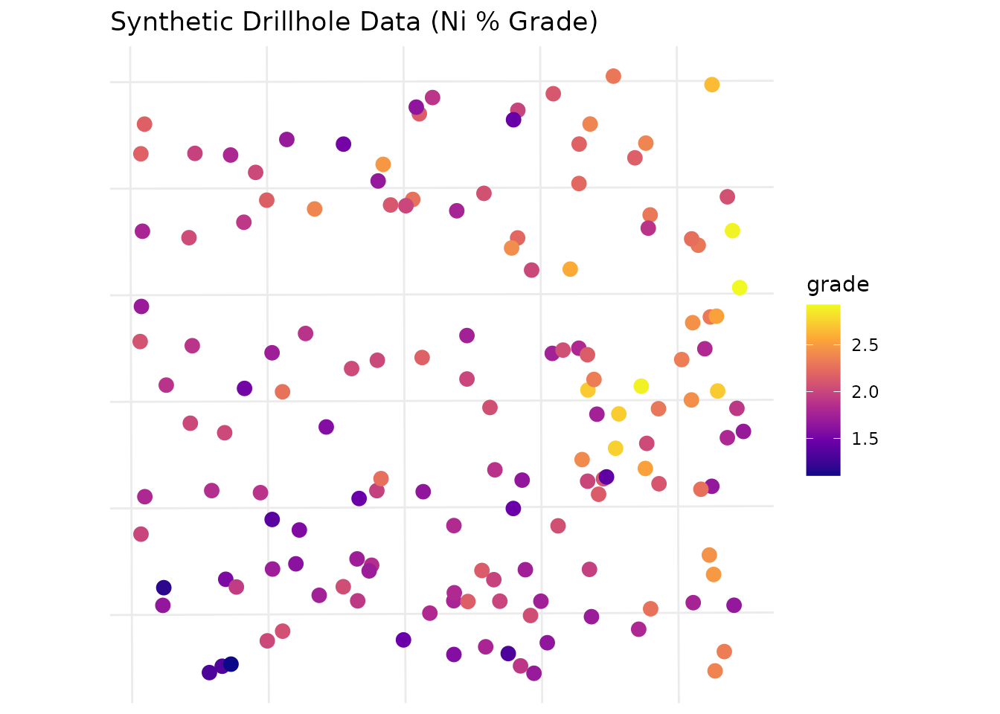
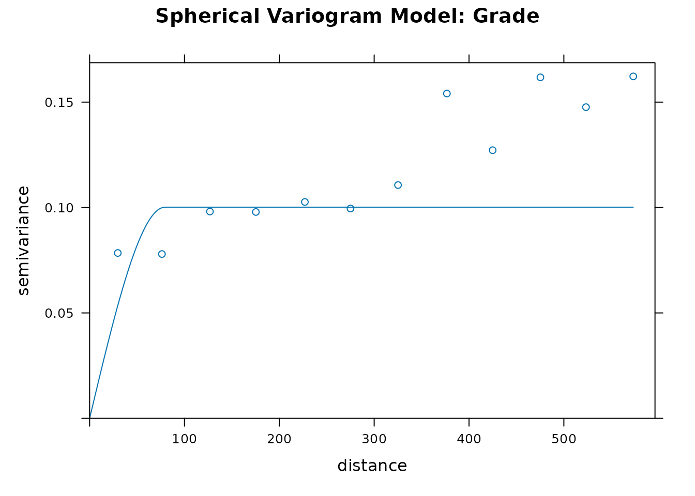
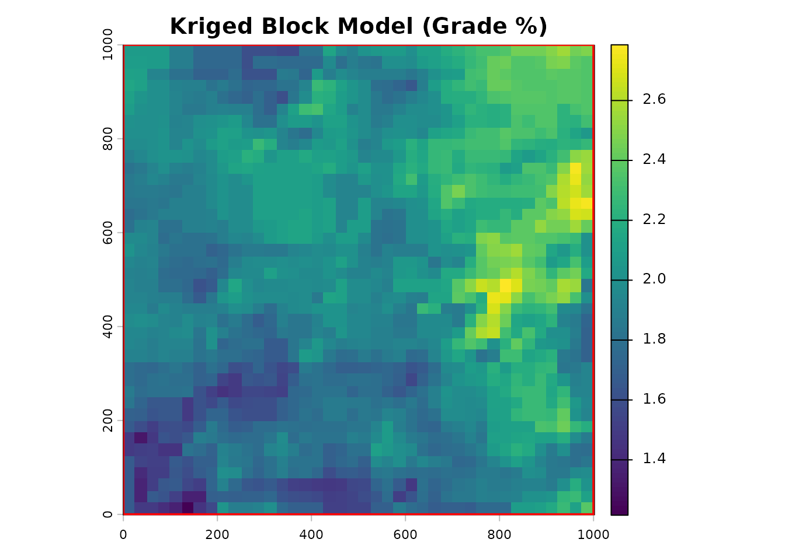
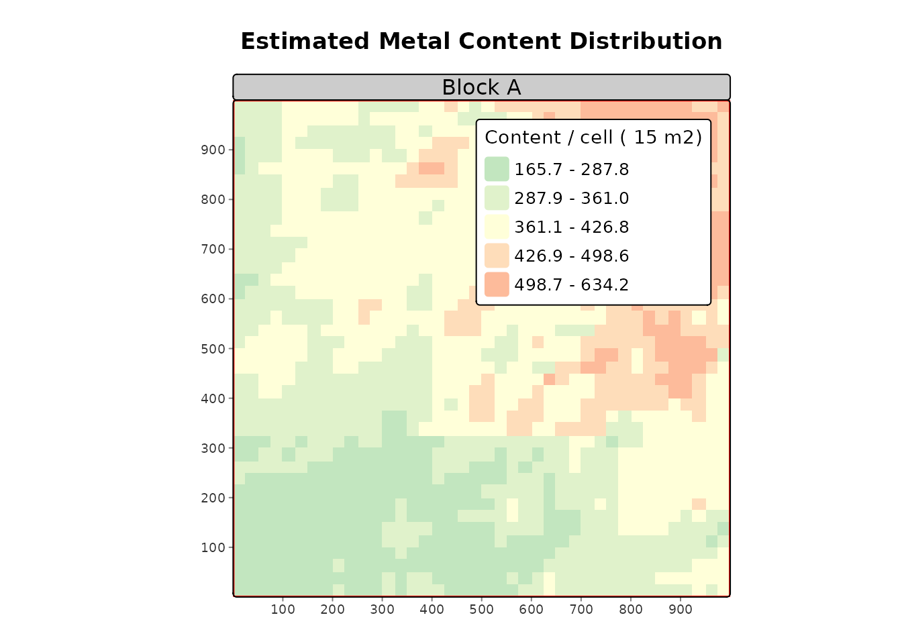

# geosR Tutorial: Resource Estimation

## Introduction

The `geosR` package provides a generalized geostatistical workflow to
calculate spatial resources (volume, metal/content tonnage, and average
grades). This vignette demonstrates a complete, end-to-end evaluation
using generated synthetic data, reflecting best practices for a Senior
Geoscientist.

``` r
library(geosR)
library(sf)
library(terra)
library(stars)
library(ggplot2)
```

### 1. Exploratory Data Analysis (EDA) & Synthetic Data Generation

In a real-world scenario, you would import drillhole data via `st_read`
or `st_as_sf`. Here, we synthesize a realistic spatial distribution
representing a nickel laterite deposit.

``` r
set.seed(42)

# 1. Generate a generic project boundary (Area of Interest)
bbox <- st_bbox(c(xmin=0, xmax=1000, ymin=0, ymax=1000), crs=32748)
area <- st_as_sf(st_as_sfc(bbox))
area$ID <- "Block_A"

# 2. Generate random drillhole points across the area
pts <- st_sample(area, size = 150, type = "random")
drill_data <- st_as_sf(pts)

# 3. Simulate geological variables (Grade and Thickness)
# We use a spatial trend (higher grades in the NE) + random noise
coords <- st_coordinates(drill_data)
trend <- (coords[,1] + coords[,2]) / 2000

drill_data$grade <- rnorm(150, mean = 1.5 + trend, sd = 0.3)
drill_data$thickness <- rnorm(150, mean = 5 + (trend * 5), sd = 1.5)

# 4. Clean outliers (Best Practice: Remove spurious data before modeling)
# We use geosR's built-in outlier removal on the raw vectors
cln_grade <- no_outlier(drill_data$grade)

# Visualize the raw drillhole grade distribution
ggplot(drill_data) +
  geom_sf(aes(color = grade), size = 3) +
  scale_color_viridis_c(option = "plasma") +
  theme_minimal() +
  labs(title = "Synthetic Drillhole Data (Ni % Grade)")
```



### 2. Variogram Modeling

A rigorous geostatistical estimate requires a well-fitted variogram. We
model the spatial continuity of the `grade` variable.

``` r
# Fit a spherical variogram model
# Note: In practice, parameters like 'cutoff' and 'sill' are iteratively refined via EDA.
var_model <- fit_var(
  data = drill_data, 
  formula = grade ~ 1, 
  cutoff = 600, 
  width = 50, 
  model_type = "Sph",
  sill = var(drill_data$grade) * 0.8, # Best practice: estimate sill from sample variance
  range = 300
)

# Plot the experimental variogram and the fitted model
plot(var_model$variogram, var_model$model, main="Spherical Variogram Model: Grade")
```



### 3. Ordinary Kriging (Block Modeling)

With our variogram established, we generate a block model grid and
predict attributes into un-sampled locations.

``` r
# Initialize a 25x25m block model grid
calc_grid <- st_make_grid(area, cellsize = 25)

# Kriging for Grade
kriged_grade <- est_krige(
  data = drill_data, 
  formula = grade ~ 1,
  grid = calc_grid, 
  vgm_model = var_model$model,
  maxdist = 400, # Limit search radius
  nmin = 3       # Require at least 3 drillholes for an estimate
)
#> [using ordinary kriging]

# Kriging for Thickness (using same spatial model for simplicity)
kriged_thick <- est_krige(
  data = drill_data, 
  formula = thickness ~ 1,
  grid = calc_grid, 
  vgm_model = var_model$model,
  maxdist = 400,
  nmin = 3
)
#> [using ordinary kriging]

# Visualize the kriged Grade predictions
grade_raster <- as(st_rasterize(kriged_grade["var1.pred"]), "SpatRaster")
plot(grade_raster, main = "Kriged Block Model (Grade %)")
plot(st_geometry(area), add=TRUE, border="red", lwd=2)
```



### 4. Resource Calculation

We calculate the total metric tonnage contained within our boundary
(`area`). We apply a specific gravity (density) of `1.6` for this
material type (typical for laterite).

``` r
# Convert the sf predictions directly to terra SpatRasters for map algebra
thick_raster <- as(st_rasterize(kriged_thick["var1.pred"]), "SpatRaster")

# Execute core resource calculation
my_resources <- calc_res(
  raster_grade = grade_raster, 
  raster_thickness = thick_raster, 
  area = area, 
  density = 1.6
)

# Review the tabular output (Polygon by Polygon)
knitr::kable(my_resources$table, digits = 2, format.args = list(big.mark = ","))
```

|  ID |   area_m2 | avg_thickness_m | expected_volume_m3 | avg_grade | metal_content |
|----:|----------:|----------------:|-------------------:|----------:|--------------:|
|   1 | 1,003,472 |            7.61 |          7,635,003 |      1.98 |    24,151,553 |

### 5. Evaluation and Reconciliation

A senior geologist’s job doesn’t end at estimation. We must evaluate
modeled resources against actual mining recovery to build confidence
factors.

``` r
# Assume the plant reported 15,000 tonnes of metal content recovered from this block
eval_table <- ev_rest(my_resources$table, actual_production = 15000)

# Display the reconciliation factor
knitr::kable(eval_table[, c("ID", "metal_content", "actual_production", "recovery_factor")], 
             digits = 3, format.args = list(big.mark = ","))
```

|  ID | metal_content | actual_production | recovery_factor |
|----:|--------------:|------------------:|----------------:|
|   1 |    24,151,553 |            15,000 |           0.001 |

*Note: A recovery factor of \< 1.0 indicates over-estimation by the
block model.*

### 6. Spatial Reporting (Plots)

Finally, we generate standardized, presentation-ready maps for
management reporting.

``` r
# Generate map utilizing tmap architecture
plot_res(
  tonnage_raster = my_resources$raster, 
  area = area, 
  title = "Estimated Metal Content Distribution",
  subtitle = "Block A"
)
#> ℹ tmap modes "plot" - "view"
#> ℹ toggle with `tmap::ttm()`
#> 
#> 
#> ── tmap v3 code detected ───────────────────────────────────────────────────────
#> 
#> [v3->v4] `tm_raster()`: instead of `style = "kmeans"`, use col.scale =
#> `tm_scale_intervals()`.
#> ℹ Migrate the argument(s) 'style', 'palette' (rename to 'values') to
#>   'tm_scale_intervals(<HERE>)'
#> [v3->v4] `tm_raster()`: use `col_alpha` instead of `alpha`.
#> [v3->v4] `tm_raster()`: migrate the argument(s) related to the legend of the
#> visual variable `col` namely 'title' to 'col.legend = tm_legend(<HERE>)'
#> [v3->v4] `tm_layout()`: use `tm_title()` instead of `tm_layout(main.title = )`
#> [plot mode] fit legend/component: Some legend items or map compoments do not
#> fit well, and are therefore rescaled.
#> ℹ Set the tmap option `component.autoscale = FALSE` to disable rescaling.
```


